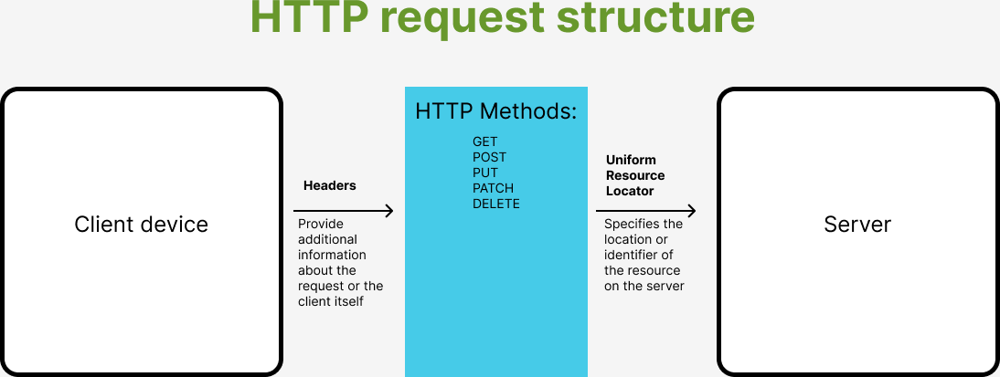

# API Research

### What are API’s?

API : **Application Programming Interface**

APIs allow different software to communicate.

### How are they used and why are they so popular?

- Allow communication between systems.
- Allows developers to use existing services and build on existing platforms.

APIs are key in modern software development for their ability to connect and extend applications.

_The data transfer process in API communication:_


### What is a REST API?

REST API : **Representational State Transfer API**

### What makes an API RESTful? What are the REST guidelines?

REST APIS are designed for interacting with web services. An API is considered RESTful if it is:

- **Stateless**: No client data is stored on the server between requests.
- **Separate**: The client and server act independently.
- **Cacheable**: Responses must define themselves as cacheable or not.
- **Layered System**: The client cannot tell whether it is connected directly to the server or an intermediary.
- **Uniform**: A standardized way to communicate between client and server.

### What is HTTP? (what does it stand for and what is it used for?

HTTP : **Hypertext Transfer Protocol**

HTTP is the foundation of data communication on the World Wide Web. It defines how messages are formatted and transmitted, and how web servers and browsers should respond to various commands. It's used for:

- **Requesting web pages**: When you visit a website, your browser sends an HTTP request to the server, which then responds with the requested page.
- **Submitting form data**: Information submitted through web forms is often sent to the server using HTTP.
- **API communication**: Many web APIs use HTTP as a protocol for sending and receiving messages.

### What is HTTPS?)

HTTPS : **Hypertext Transfer Protocol Secure**

HTTPS is the secure version of HTTP, where communications are encrypted using Transport Layer Security (TLS) or Secure Sockets Layer (SSL). This adds a layer of security, making it essential for confidential online transactions like online banking or shopping.

_The HTTP request structure:_



### HTTP Verbs and Their Functions

HTTP "verbs" are a series of action that can be performed on a given resource. Here are five common HTTP verbs:

- **GET**: Used to retrieve data from a specified resource. GET requests should only retrieve data and have no other effect.
  
- **POST**: Used to send data to a server to create or update a resource. The data is included in the body of the request. POST requests are often used to submit form data or upload a file.

- **PUT**: Used to send data to a server to create or replace a resource. The difference between PUT and POST is that PUT requests are idempotent; calling the same PUT request multiple times will always produce the same result.

- **PATCH**: Used to apply partial modifications to a resource. Unlike PUT, PATCH is not idempotent, meaning successive identical patch requests may have different effects.

- **DELETE**: Used to delete the specified resource.

### What is statelessness? Show examples of “stateless” and “stateful” http requests.

Statelessness in web development refers to the server not storing any state about the client session on the server side. Each request from the client to the server must contain all the information necessary to understand and complete the request. The server does not rely on information stored from previous requests.

#### Stateless HTTP Request Example

A **stateless** HTTP request does not require the server to remember any previous interaction. Each request is self-contained, carrying all necessary information.

```http
GET /api/products/123 HTTP/1.1
Host: example.com
```
In this example, a client requests details for a product with an ID of 123. The request is stateless because it contains all the information the server needs to process it (the product ID), without needing any prior knowledge of past requests.

#### Stateful HTTP Request Example
A stateful HTTP request relies on the server remembering previous interactions. Stateful behavior often involves tracking sessions.

```GET /api/my-cart HTTP/1.1
Host: example.com
Cookie: sessionId=abc123
```

In this stateful example, the client requests their shopping cart contents. The server needs to know who "my" refers to, which it determines from a session ID stored in a cookie. The server must remember or look up the session data associated with this ID to respond appropriately.

Stateful interactions can offer a more personalized experience but at the cost of higher complexity and resource usage on the server side.

### What is Caching?

Caching is a method of temporarily storing copies of data or files in a cache, a high-speed data storage layer, to improve the speed and efficiency of data retrieval. It's used extensively in computing and web technologies to reduce latency, decrease server load, and improve user experience. When a piece of data or a file is requested, the system first checks the cache:

- **Hit**: If the data is found in the cache (a "cache hit"), it's returned to the user quickly, avoiding the need to compute or fetch the data from its original storage location.
  
- **Miss**: If the data is not in the cache (a "cache miss"), it's retrieved from the original source, and a copy is usually stored in the cache for future requests.

#### Examples of Caching:

- **Web Browsers**: Store copies of web pages, images, and other resources so that they load faster on subsequent visits.
- **Content Delivery Networks (CDNs)**: Cache content closer to users geographically to reduce latency and speed up content delivery.
- **Databases**: Cache frequently accessed queries or results to speed up data retrieval in future requests.

Caching is a critical performance optimization technique that balances the trade-off between data freshness and retrieval speed.
